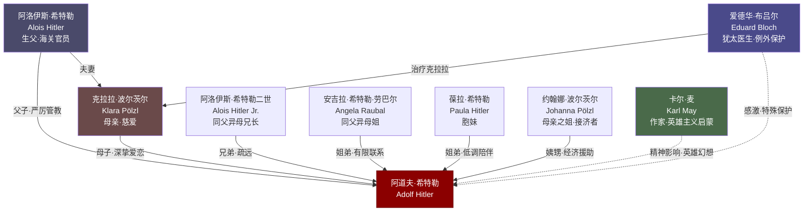

# 关系图：01-家人与童年

本图展示托兰《Adolf Hitler》中"家人与童年"时期（第一章）人物与希特勒的关系网络。

## 人物说明

| 人物 | 与希特勒关系 | 档案链接 |
|------|------------|---------|
| [阿洛伊斯·希特勒](../01-家人与童年/阿洛伊斯·希特勒.md) | 生父，严厉权威 | ✅ |
| [克拉拉·波尔茨尔](../01-家人与童年/克拉拉·波尔茨尔.md) | 慈爱母亲，深受怀念 | ✅ |
| [阿洛伊斯·希特勒二世](../01-家人与童年/阿洛伊斯·希特勒二世.md) | 同父异母兄长，关系疏远 | ✅ |
| [安吉拉·希特勒·劳巴尔](../01-家人与童年/安吉拉·希特勒·劳巴尔.md) | 同父异母姐，后期牵涉格丽事件 | ✅ |
| [葆拉·希特勒](../01-家人与童年/葆拉·希特勒.md) | 胞妹，终生低调 | ✅ |
| [约翰娜·波尔茨尔](../01-家人与童年/约翰娜·波尔茨尔.md) | 母亲之姐，接济早年 | ✅ |
| [卡尔·麦](../01-家人与童年/卡尔·麦.md) | 冒险小说家，精神启蒙 | ✅ |
| [爱德华·布吕尔](../01-家人与童年/爱德华·布吕尔.md) | 犹太医生，受特殊保护 | ✅ |

---
> 阶段2-批次1 | 更新时间：2026-04-21
