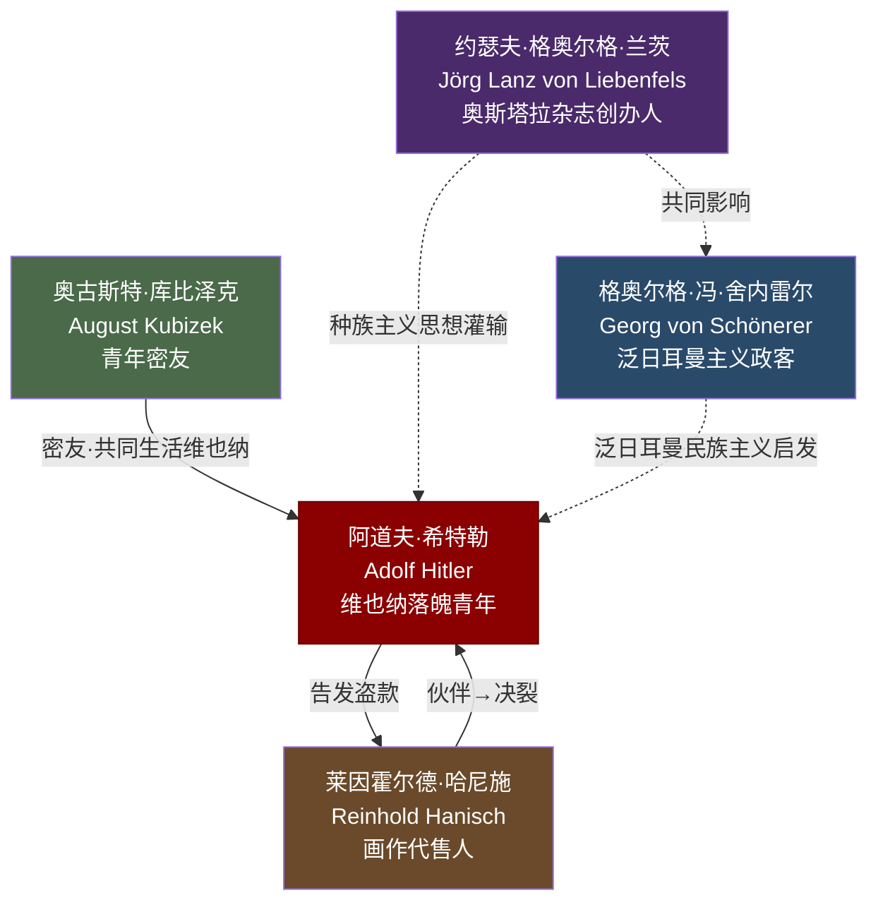

# 关系图：02-青年与流浪

本图展示托兰《Adolf Hitler》中"青年与流浪"时期（第二章）人物与希特勒的关系网络。

## 人物说明

| 人物 | 与希特勒关系 | 档案链接 |
|------|------------|---------|
| [奥古斯特·库比泽克](../02-青年与流浪/奥古斯特·库比泽克.md) | 维也纳青年密友，后著回忆录 | ✅ |
| [莱因霍尔德·哈尼施](../02-青年与流浪/莱因霍尔德·哈尼施.md) | 画作代售伙伴，后反目 | ✅ |
| [约瑟夫·格奥尔格·兰茨](../02-青年与流浪/约瑟夫·格奥尔格·兰茨.md) | 《奥斯塔拉》创办人，反犹思想来源 | ✅ |
| [格奥尔格·冯·舍内雷尔](../02-青年与流浪/格奥尔格·冯·舍内雷尔.md) | 泛日耳曼政客，思想导师 | ✅ |

---
> 阶段2-批次1 | 更新时间：2026-04-21
