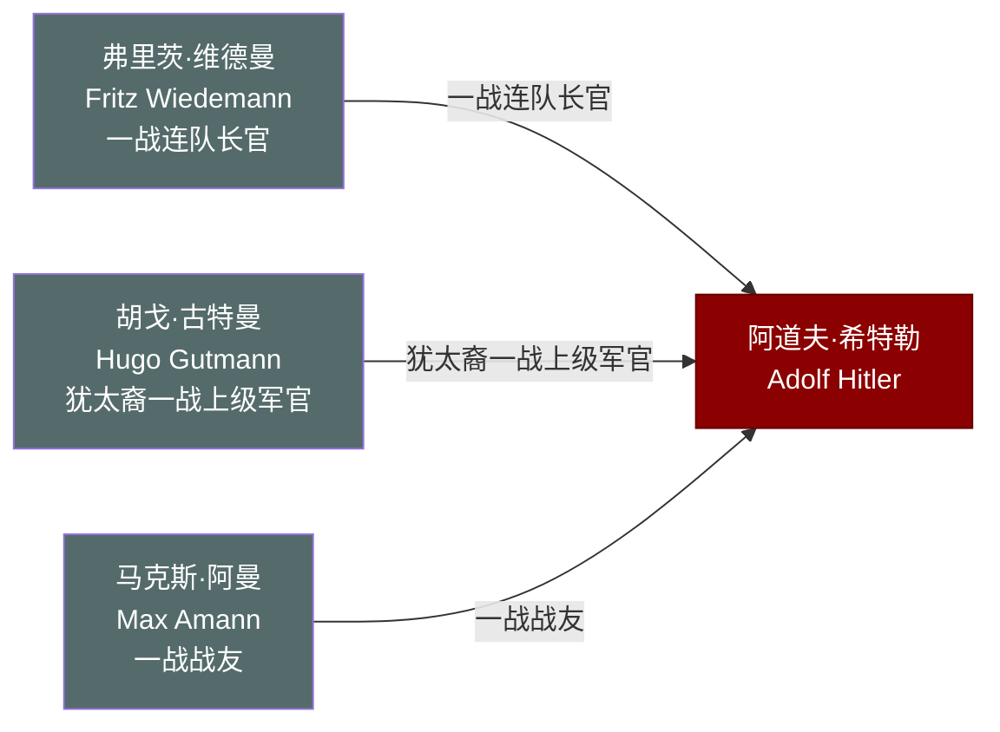

# 关系图：03-一战时期

本图展示托兰《Adolf Hitler》中"一战时期"（1914-1918年）人物与希特勒的关系网络。

## 人物说明

| 人物 | 与希特勒关系 | 档案链接 |
|------|------------|---------||
| [弗里茨·维德曼](../03-%E4%B8%80%E6%88%98%E6%97%B6%E6%9C%9F/%E5%BC%97%E9%87%8C%E8%8C%A8%C2%B7%E7%BB%B4%E5%BE%B7%E6%9B%BC.md) | 一战连队长官，战后为希特勒军功作证，保持长期联系 | ✅ |
| [胡戈·古特曼](../03-%E4%B8%80%E6%88%98%E6%97%B6%E6%9C%9F/%E8%83%A1%E6%88%88%C2%B7%E5%8F%A4%E7%89%B9%E6%9B%BC.md) | 犹太裔一战上级军官，推荐希特勒获铁十字勋章一级 | ✅ |
| [马克斯·阿曼](../03-%E4%B8%80%E6%88%98%E6%97%B6%E6%9C%9F/%E9%A9%AC%E5%85%8B%E6%96%AF%C2%B7%E9%98%BF%E6%9B%BC.md) | 一战战友，后任党出版社主任，长期掌控纳粹宣传出版 | ✅ |
