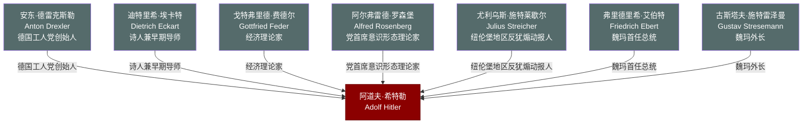

# 关系图：04-慕尼黑与NSDAP早期

本图展示托兰《Adolf Hitler》中"慕尼黑与NSDAP早期"时期人物与希特勒的关系网络。

## 人物说明

| 人物 | 与希特勒关系 | 档案链接 |
|------|------------|---------||
| [安东·德雷克斯勒](../04-%E6%85%95%E5%B0%BC%E9%BB%91%E4%B8%8ENSDAP%E6%97%A9%E6%9C%9F/%E5%AE%89%E4%B8%9C%C2%B7%E5%BE%B7%E9%9B%B7%E5%85%8B%E6%96%AF%E5%8B%92.md) | 德国工人党创始人，希特勒加入后迅速被取而代之 | ✅ |
| [迪特里希·埃卡特](../04-%E6%85%95%E5%B0%BC%E9%BB%91%E4%B8%8ENSDAP%E6%97%A9%E6%9C%9F/%E8%BF%AA%E7%89%B9%E9%87%8C%E5%B8%8C%C2%B7%E5%9F%83%E5%8D%A1%E7%89%B9.md) | 诗人兼早期导师，引领希特勒进入慕尼黑上流政治圈 | ✅ |
| [戈特弗里德·费德尔](../04-%E6%85%95%E5%B0%BC%E9%BB%91%E4%B8%8ENSDAP%E6%97%A9%E6%9C%9F/%E6%88%88%E7%89%B9%E5%BC%97%E9%87%8C%E5%BE%B7%C2%B7%E8%B4%B9%E5%BE%B7%E5%B0%94.md) | 经济理论家，打倒利息奴役思想成为纳粹早期纲领来源 | ✅ |
| [阿尔弗雷德·罗森堡](../04-%E6%85%95%E5%B0%BC%E9%BB%91%E4%B8%8ENSDAP%E6%97%A9%E6%9C%9F/%E9%98%BF%E5%B0%94%E5%BC%97%E9%9B%B7%E5%BE%B7%C2%B7%E7%BD%97%E6%A3%AE%E5%A0%A1.md) | 党首席意识形态理论家，主导种族与东方政策的意识形态建构 | ✅ |
| [尤利乌斯·施特莱歇尔](../04-%E6%85%95%E5%B0%BC%E9%BB%91%E4%B8%8ENSDAP%E6%97%A9%E6%9C%9F/%E5%B0%A4%E5%88%A9%E4%B9%8C%E6%96%AF%C2%B7%E6%96%BD%E7%89%B9%E8%8E%B1%E6%AD%87%E5%B0%94.md) | 纽伦堡地区反犹煽动报人，出版《冲锋队员》传播极端反犹思想 | ✅ |
| [弗里德里希·艾伯特](../04-%E6%85%95%E5%B0%BC%E9%BB%91%E4%B8%8ENSDAP%E6%97%A9%E6%9C%9F/%E5%BC%97%E9%87%8C%E5%BE%B7%E9%87%8C%E5%B8%8C%C2%B7%E8%89%BE%E4%BC%AF%E7%89%B9.md) | 魏玛首任总统，代表希特勒所反对的共和制度与十一月革命 | ✅ |
| [古斯塔夫·施特雷泽曼](../04-%E6%85%95%E5%B0%BC%E9%BB%91%E4%B8%8ENSDAP%E6%97%A9%E6%9C%9F/%E5%8F%A4%E6%96%AF%E5%A1%94%E5%A4%AB%C2%B7%E6%96%BD%E7%89%B9%E9%9B%B7%E6%B3%BD%E6%9B%BC.md) | 魏玛外长，推动洛迦诺条约与国联外交，与希特勒路线截然对立 | ✅ |
