# 关系图：05-啤酒馆暴动与狱中

本图展示托兰《Adolf Hitler》中"啤酒馆暴动与狱中"时期（1923-1924年）人物与希特勒的关系网络。

```mermaid
graph TD
    AH["阿道夫·希特勒<br/>Adolf Hitler"]

    %% 啤酒馆暴动
    N0["鲁道夫·赫斯<br/>Rudolf Heß<br/>最忠诚副手"]
    N1["赫尔曼·戈林<br/>Hermann Göring<br/>暴动重要参与者"]
    N2["恩斯特·罗姆<br/>Ernst Röhm<br/>冲锋队创建者"]
    N3["埃里希·鲁登道夫<br/>Erich Ludendorff<br/>暴动名义军事领袖"]
    N4["古斯塔夫·里特尔·冯·卡尔<br/>Gustav Ritter von Kahr<br/>巴伐利亚总督"]
    N5["奥托·冯·洛索夫<br/>Otto von Lossow<br/>巴伐利亚驻军司令"]
    N6["汉斯·里特尔·冯·赛塞尔<br/>Hans Ritter von Seißer<br/>巴伐利亚警察长官"]

    %% 狱中与资助者
    N7["埃米尔·莫里斯<br/>Emil Maurice<br/>早期私人司机"]
    N8["恩斯特·汉夫施滕格尔<br/>Ernst Hanfstaengl<br/>哈佛出身社交中介"]
    N9["海伦娜·贝希施泰因<br/>Helene Bechstein<br/>钢琴制造世家女主人"]
    N10["埃尔莎·布鲁克曼<br/>Elsa Bruckmann<br/>慕尼黑文艺沙龙女主人"]

    %% 关系连线
    N0 -->|"最忠诚副手"| AH
    N1 -->|"暴动重要参与者"| AH
    N2 -->|"冲锋队创建者"| AH
    N3 -->|"暴动名义军事领袖"| AH
    N4 -->|"巴伐利亚总督"| AH
    N5 -->|"巴伐利亚驻军司令"| AH
    N6 -->|"巴伐利亚警察长官"| AH
    N7 -->|"早期私人司机"| AH
    N8 -->|"哈佛出身社交中介"| AH
    N9 -->|"钢琴制造世家女主人"| AH
    N10 -->|"慕尼黑文艺沙龙女主人"| AH

    %% 样式
    style AH fill:#8B0000,color:#fff,stroke:#600
    style N0 fill:#556b6b,color:#fff
    style N1 fill:#556b6b,color:#fff
    style N2 fill:#556b6b,color:#fff
    style N3 fill:#556b6b,color:#fff
    style N4 fill:#556b6b,color:#fff
    style N5 fill:#556b6b,color:#fff
    style N6 fill:#556b6b,color:#fff
    style N7 fill:#556b6b,color:#fff
    style N8 fill:#556b6b,color:#fff
    style N9 fill:#556b6b,color:#fff
    style N10 fill:#556b6b,color:#fff
```

## 人物说明

| 人物 | 与希特勒关系 | 档案链接 |
|------|------------|---------||
| [鲁道夫·赫斯](../05-%E5%95%A4%E9%85%92%E9%A6%86%E6%9A%B4%E5%8A%A8%E4%B8%8E%E7%8B%B1%E4%B8%AD/%E9%B2%81%E9%81%93%E5%A4%AB%C2%B7%E8%B5%AB%E6%96%AF.md) | 最忠诚副手，狱中协助记录《我的奋斗》，终生效命 | ✅ |
| [赫尔曼·戈林](../05-%E5%95%A4%E9%85%92%E9%A6%86%E6%9A%B4%E5%8A%A8%E4%B8%8E%E7%8B%B1%E4%B8%AD/%E8%B5%AB%E5%B0%94%E6%9B%BC%C2%B7%E6%88%88%E6%9E%97.md) | 暴动重要参与者，后掌管空军，为纳粹政权二号人物 | ✅ |
| [恩斯特·罗姆](../05-%E5%95%A4%E9%85%92%E9%A6%86%E6%9A%B4%E5%8A%A8%E4%B8%8E%E7%8B%B1%E4%B8%AD/%E6%81%A9%E6%96%AF%E7%89%B9%C2%B7%E7%BD%97%E5%A7%86.md) | 冲锋队创建者，军事组织重要支柱，后因权力威胁遭清洗 | ✅ |
| [埃里希·鲁登道夫](../05-%E5%95%A4%E9%85%92%E9%A6%86%E6%9A%B4%E5%8A%A8%E4%B8%8E%E7%8B%B1%E4%B8%AD/%E5%9F%83%E9%87%8C%E5%B8%8C%C2%B7%E9%B2%81%E7%99%BB%E9%81%93%E5%A4%AB.md) | 暴动名义军事领袖，声望为暴动背书，后与希特勒反目 | ✅ |
| [古斯塔夫·里特尔·冯·卡尔](../05-%E5%95%A4%E9%85%92%E9%A6%86%E6%9A%B4%E5%8A%A8%E4%B8%8E%E7%8B%B1%E4%B8%AD/%E5%8F%A4%E6%96%AF%E5%A1%94%E5%A4%AB%C2%B7%E9%87%8C%E7%89%B9%E5%B0%94%C2%B7%E5%86%AF%C2%B7%E5%8D%A1%E5%B0%94.md) | 巴伐利亚总督，暴动中被挟持后转而镇压，导致政变失败 | ✅ |
| [奥托·冯·洛索夫](../05-%E5%95%A4%E9%85%92%E9%A6%86%E6%9A%B4%E5%8A%A8%E4%B8%8E%E7%8B%B1%E4%B8%AD/%E5%A5%A5%E6%89%98%C2%B7%E5%86%AF%C2%B7%E6%B4%9B%E7%B4%A2%E5%A4%AB.md) | 巴伐利亚驻军司令，暴动中被胁迫后出卖希特勒，参与镇压 | ✅ |
| [汉斯·里特尔·冯·赛塞尔](../05-%E5%95%A4%E9%85%92%E9%A6%86%E6%9A%B4%E5%8A%A8%E4%B8%8E%E7%8B%B1%E4%B8%AD/%E6%B1%89%E6%96%AF%C2%B7%E9%87%8C%E7%89%B9%E5%B0%94%C2%B7%E5%86%AF%C2%B7%E8%B5%9B%E5%A1%9E%E5%B0%94.md) | 巴伐利亚警察长官，暴动中被胁迫后与卡尔、洛索夫联手镇压 | ✅ |
| [埃米尔·莫里斯](../05-%E5%95%A4%E9%85%92%E9%A6%86%E6%9A%B4%E5%8A%A8%E4%B8%8E%E7%8B%B1%E4%B8%AD/%E5%9F%83%E7%B1%B3%E5%B0%94%C2%B7%E8%8E%AB%E9%87%8C%E6%96%AF.md) | 早期私人司机，暴动同行者，狱中室友，私人圈核心成员 | ✅ |
| [恩斯特·汉夫施滕格尔](../05-%E5%95%A4%E9%85%92%E9%A6%86%E6%9A%B4%E5%8A%A8%E4%B8%8E%E7%8B%B1%E4%B8%AD/%E6%81%A9%E6%96%AF%E7%89%B9%C2%B7%E6%B1%89%E5%A4%AB%E6%96%BD%E6%BB%95%E6%A0%BC%E5%B0%94.md) | 哈佛出身社交中介，将希特勒引入国际媒体与上流社会 | ✅ |
| [海伦娜·贝希施泰因](../05-%E5%95%A4%E9%85%92%E9%A6%86%E6%9A%B4%E5%8A%A8%E4%B8%8E%E7%8B%B1%E4%B8%AD/%E6%B5%B7%E4%BC%A6%E5%A8%9C%C2%B7%E8%B4%9D%E5%B8%8C%E6%96%BD%E6%B3%B0%E5%9B%A0.md) | 钢琴制造世家女主人，为希特勒提供资金与上流社会人脉 | ✅ |
| [埃尔莎·布鲁克曼](../05-%E5%95%A4%E9%85%92%E9%A6%86%E6%9A%B4%E5%8A%A8%E4%B8%8E%E7%8B%B1%E4%B8%AD/%E5%9F%83%E5%B0%94%E8%8E%8E%C2%B7%E5%B8%83%E9%B2%81%E5%85%8B%E6%9B%BC.md) | 慕尼黑文艺沙龙女主人，为希特勒引荐工业界与贵族资助者 | ✅ |
