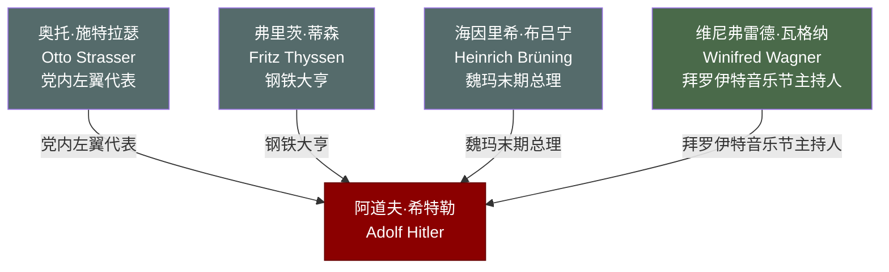

# 关系图：06-党的壮大

本图展示托兰《Adolf Hitler》中"党的壮大"时期（1925-1932年）人物与希特勒的关系网络。

## 人物说明

| 人物 | 与希特勒关系 | 档案链接 |
|------|------------|---------||
| [奥托·施特拉瑟](../06-%E5%85%9A%E7%9A%84%E5%A3%AE%E5%A4%A7/%E5%A5%A5%E6%89%98%C2%B7%E6%96%BD%E7%89%B9%E6%8B%89%E7%91%9F.md) | 党内左翼代表，因反对希特勒路线被驱逐，流亡海外持续批判 | ✅ |
| [弗里茨·蒂森](../06-%E5%85%9A%E7%9A%84%E5%A3%AE%E5%A4%A7/%E5%BC%97%E9%87%8C%E8%8C%A8%C2%B7%E8%92%82%E6%A3%AE.md) | 钢铁大亨，早期为纳粹党提供巨额政治献金与工业支持 | ✅ |
| [海因里希·布吕宁](../06-%E5%85%9A%E7%9A%84%E5%A3%AE%E5%A4%A7/%E6%B5%B7%E5%9B%A0%E9%87%8C%E5%B8%8C%C2%B7%E5%B8%83%E5%90%95%E5%AE%81.md) | 魏玛末期总理，实行紧缩政策，客观上为纳粹崛起创造条件 | ✅ |
| [维尼弗雷德·瓦格纳](../06-%E5%85%9A%E7%9A%84%E5%A3%AE%E5%A4%A7/%E7%BB%B4%E5%B0%BC%E5%BC%97%E9%9B%B7%E5%BE%B7%C2%B7%E7%93%A6%E6%A0%BC%E7%BA%B3.md) | 拜罗伊特音乐节主持人，崇拜希特勒，为其提供文化庇护圈 | ✅ |
