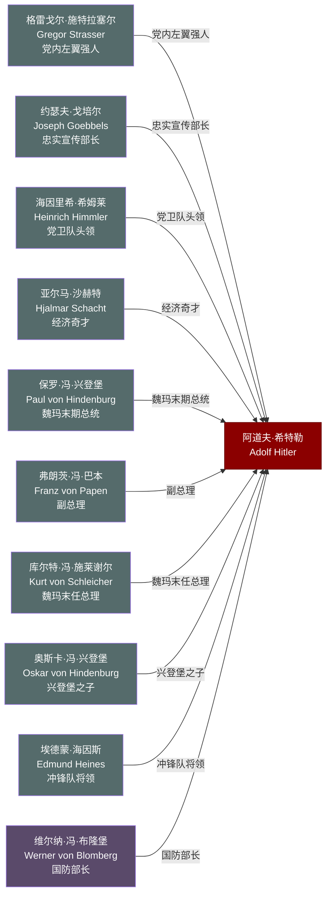

# 关系图：07-夺权与执政

本图展示托兰《Adolf Hitler》中"夺权与执政"时期（1933-1939年）人物与希特勒的关系网络。

## 人物说明

| 人物 | 与希特勒关系 | 档案链接 |
|------|------------|---------||
| [格雷戈尔·施特拉塞尔](../07-%E5%A4%BA%E6%9D%83%E4%B8%8E%E6%89%A7%E6%94%BF/%E6%A0%BC%E9%9B%B7%E6%88%88%E5%B0%94%C2%B7%E6%96%BD%E7%89%B9%E6%8B%89%E5%A1%9E%E5%B0%94.md) | 党内左翼强人，组织北德支部，后因路线分歧被边缘化清洗 | ✅ |
| [约瑟夫·戈培尔](../07-%E5%A4%BA%E6%9D%83%E4%B8%8E%E6%89%A7%E6%94%BF/%E7%BA%A6%E7%91%9F%E5%A4%AB%C2%B7%E6%88%88%E5%9F%B9%E5%B0%94.md) | 忠实宣传部长，掌控媒体与舆论，将希特勒塑造为民族领袖 | ✅ |
| [海因里希·希姆莱](../07-%E5%A4%BA%E6%9D%83%E4%B8%8E%E6%89%A7%E6%94%BF/%E6%B5%B7%E5%9B%A0%E9%87%8C%E5%B8%8C%C2%B7%E5%B8%8C%E5%A7%86%E8%8E%B1.md) | 党卫队头领，执行种族灭绝政策，是希特勒最忠实的执行者之一 | ✅ |
| [亚尔马·沙赫特](../07-%E5%A4%BA%E6%9D%83%E4%B8%8E%E6%89%A7%E6%94%BF/%E4%BA%9A%E5%B0%94%E9%A9%AC%C2%B7%E6%B2%99%E8%B5%AB%E7%89%B9.md) | 经济奇才，帮助希特勒重建德国经济并解决失业问题，后期失宠 | ✅ |
| [保罗·冯·兴登堡](../07-%E5%A4%BA%E6%9D%83%E4%B8%8E%E6%89%A7%E6%94%BF/%E4%BF%9D%E7%BD%97%C2%B7%E5%86%AF%C2%B7%E5%85%B4%E7%99%BB%E5%A0%A1.md) | 魏玛末期总统，最终签署授权希特勒出任总理的任命令 | ✅ |
| [弗朗茨·冯·巴本](../07-%E5%A4%BA%E6%9D%83%E4%B8%8E%E6%89%A7%E6%94%BF/%E5%BC%97%E6%9C%97%E8%8C%A8%C2%B7%E5%86%AF%C2%B7%E5%B7%B4%E6%9C%AC.md) | 副总理，认为可以驾驭希特勒，实则成为纳粹夺权的帮凶 | ✅ |
| [库尔特·冯·施莱谢尔](../07-%E5%A4%BA%E6%9D%83%E4%B8%8E%E6%89%A7%E6%94%BF/%E5%BA%93%E5%B0%94%E7%89%B9%C2%B7%E5%86%AF%C2%B7%E6%96%BD%E8%8E%B1%E8%B0%A2%E5%B0%94.md) | 魏玛末任总理，试图以军事手段阻止希特勒上台，最终失败 | ✅ |
| [奥斯卡·冯·兴登堡](../07-%E5%A4%BA%E6%9D%83%E4%B8%8E%E6%89%A7%E6%94%BF/%E5%A5%A5%E6%96%AF%E5%8D%A1%C2%B7%E5%86%AF%C2%B7%E5%85%B4%E7%99%BB%E5%A0%A1.md) | 兴登堡之子，被希特勒利用施压其父签署总理任命令 | ✅ |
| [埃德蒙·海因斯](../07-%E5%A4%BA%E6%9D%83%E4%B8%8E%E6%89%A7%E6%94%BF/%E5%9F%83%E5%BE%B7%E8%92%99%C2%B7%E6%B5%B7%E5%9B%A0%E6%96%AF.md) | 冲锋队将领，长刀之夜中以同性恋罪名为由被杀，清洗SA权力 | ✅ |
| [维尔纳·冯·布隆堡](../07-%E5%A4%BA%E6%9D%83%E4%B8%8E%E6%89%A7%E6%94%BF/%E7%BB%B4%E5%B0%94%E7%BA%B3%C2%B7%E5%86%AF%C2%B7%E5%B8%83%E9%9A%86%E5%A0%A1.md) | 国防部长，支持希特勒兼并军权，后因绯闻婚姻被迫去职 | ✅ |
