# 关系图：08-战争时期

本图展示托兰《Adolf Hitler》中"战争时期"（1939-1945年）人物与希特勒的关系网络。

```mermaid
graph TD
    AH["阿道夫·希特勒<br/>Adolf Hitler"]

    %% 军事将领
    N0["瓦尔特·冯·布劳希奇<br/>Walther von Brauchitsch<br/>陆军总司令"]
    N1["威廉·凯特尔<br/>Wilhelm Keitel<br/>最高统帅部长"]
    N2["阿尔弗雷德·约德尔<br/>Alfred Jodl<br/>最高统帅部作战部长"]
    N3["弗朗茨·哈尔德<br/>Franz Halder<br/>参谋总长"]
    N5["海因茨·古德里安<br/>Heinz Guderian<br/>装甲战术先驱"]
    N6["埃尔温·隆美尔<br/>Erwin Rommel<br/>沙漠之狐"]
    N7["埃里希·冯·曼施坦因<br/>Erich von Manstein<br/>战略大师"]

    %% 反对者与刺杀者
    N4["路德维希·贝克<br/>Ludwig Beck<br/>参谋总长"]

    %% 党卫队与安全机构
    N8["莱因哈德·海德里希<br/>Reinhard Heydrich<br/>RSHA头领"]
    N9["恩斯特·卡尔滕布伦纳<br/>Ernst Kaltenbrunner<br/>继任RSHA头领"]
    N10["阿道夫·艾希曼<br/>Adolf Eichmann<br/>大屠杀执行官"]
    N11["海因里希·米勒<br/>Heinrich Müller<br/>盖世太保长官"]

    %% 私人圈
    N12["阿尔伯特·施佩尔<br/>Albert Speer<br/>首席建筑师后任军备部长"]

    %% 关系连线
    N0 -->|"陆军总司令"| AH
    N1 -->|"最高统帅部长"| AH
    N2 -->|"最高统帅部作战部长"| AH
    N3 -->|"参谋总长"| AH
    N4 -->|"参谋总长"| AH
    N5 -->|"装甲战术先驱"| AH
    N6 -->|"沙漠之狐"| AH
    N7 -->|"战略大师"| AH
    N8 -->|"RSHA头领"| AH
    N9 -->|"继任RSHA头领"| AH
    N10 -->|"大屠杀执行官"| AH
    N11 -->|"盖世太保长官"| AH
    N12 -->|"首席建筑师后任军备部长"| AH

    %% 样式
    style AH fill:#8B0000,color:#fff,stroke:#600
    style N0 fill:#5a4a6a,color:#fff
    style N1 fill:#5a4a6a,color:#fff
    style N2 fill:#5a4a6a,color:#fff
    style N3 fill:#5a4a6a,color:#fff
    style N4 fill:#556b6b,color:#fff
    style N5 fill:#5a4a6a,color:#fff
    style N6 fill:#5a4a6a,color:#fff
    style N7 fill:#5a4a6a,color:#fff
    style N8 fill:#556b6b,color:#fff
    style N9 fill:#556b6b,color:#fff
    style N10 fill:#556b6b,color:#fff
    style N11 fill:#556b6b,color:#fff
    style N12 fill:#6a4a8a,color:#fff
```

## 人物说明

| 人物 | 与希特勒关系 | 档案链接 |
|------|------------|---------||
| [瓦尔特·冯·布劳希奇](../08-%E6%88%98%E4%BA%89%E6%97%B6%E6%9C%9F/%E7%93%A6%E5%B0%94%E7%89%B9%C2%B7%E5%86%AF%C2%B7%E5%B8%83%E5%8A%B3%E5%B8%8C%E5%A5%87.md) | 陆军总司令，执行侵略战争命令，战后以战争罪受审 | ✅ |
| [威廉·凯特尔](../08-%E6%88%98%E4%BA%89%E6%97%B6%E6%9C%9F/%E5%A8%81%E5%BB%89%C2%B7%E5%87%AF%E7%89%B9%E5%B0%94.md) | 最高统帅部长，唯命是从，被称为'希特勒的哈巴狗' | ✅ |
| [阿尔弗雷德·约德尔](../08-%E6%88%98%E4%BA%89%E6%97%B6%E6%9C%9F/%E9%98%BF%E5%B0%94%E5%BC%97%E9%9B%B7%E5%BE%B7%C2%B7%E7%BA%A6%E5%BE%B7%E5%B0%94.md) | 最高统帅部作战部长，执行希特勒战略命令，战后被纽伦堡处决 | ✅ |
| [弗朗茨·哈尔德](../08-%E6%88%98%E4%BA%89%E6%97%B6%E6%9C%9F/%E5%BC%97%E6%9C%97%E8%8C%A8%C2%B7%E5%93%88%E5%B0%94%E5%BE%B7.md) | 参谋总长，与希特勒战略分歧严重，1942年被免职 | ✅ |
| [路德维希·贝克](../08-%E6%88%98%E4%BA%89%E6%97%B6%E6%9C%9F/%E8%B7%AF%E5%BE%B7%E7%BB%B4%E5%B8%8C%C2%B7%E8%B4%9D%E5%85%8B.md) | 参谋总长，因反对希特勒战略而辞职，后参与抵抗运动并自杀 | ✅ |
| [海因茨·古德里安](../08-%E6%88%98%E4%BA%89%E6%97%B6%E6%9C%9F/%E6%B5%B7%E5%9B%A0%E8%8C%A8%C2%B7%E5%8F%A4%E5%BE%B7%E9%87%8C%E5%AE%89.md) | 装甲战术先驱，推动闪击战理念，与希特勒既合作又争执 | ✅ |
| [埃尔温·隆美尔](../08-%E6%88%98%E4%BA%89%E6%97%B6%E6%9C%9F/%E5%9F%83%E5%B0%94%E6%B8%A9%C2%B7%E9%9A%86%E7%BE%8E%E5%B0%94.md) | 沙漠之狐，北非战场名将，后被迫服毒自杀因涉嫌刺杀阴谋 | ✅ |
| [埃里希·冯·曼施坦因](../08-%E6%88%98%E4%BA%89%E6%97%B6%E6%9C%9F/%E5%9F%83%E9%87%8C%E5%B8%8C%C2%B7%E5%86%AF%C2%B7%E6%9B%BC%E6%96%BD%E5%9D%A6%E5%9B%A0.md) | 战略大师，曾献计反攻法国，后因与希特勒分歧被调离要职 | ✅ |
| [莱因哈德·海德里希](../08-%E6%88%98%E4%BA%89%E6%97%B6%E6%9C%9F/%E8%8E%B1%E5%9B%A0%E5%93%88%E5%BE%B7%C2%B7%E6%B5%B7%E5%BE%B7%E9%87%8C%E5%B8%8C.md) | RSHA头领，执行最终解决方案，1942年被刺杀身亡 | ✅ |
| [恩斯特·卡尔滕布伦纳](../08-%E6%88%98%E4%BA%89%E6%97%B6%E6%9C%9F/%E6%81%A9%E6%96%AF%E7%89%B9%C2%B7%E5%8D%A1%E5%B0%94%E6%BB%95%E5%B8%83%E4%BC%A6%E7%BA%B3.md) | 继任RSHA头领，继续执行种族灭绝，战后被纽伦堡处决 | ✅ |
| [阿道夫·艾希曼](../08-%E6%88%98%E4%BA%89%E6%97%B6%E6%9C%9F/%E9%98%BF%E9%81%93%E5%A4%AB%C2%B7%E8%89%BE%E5%B8%8C%E6%9B%BC.md) | 大屠杀执行官，负责组织驱逐和屠杀数百万犹太人 | ✅ |
| [海因里希·米勒](../08-%E6%88%98%E4%BA%89%E6%97%B6%E6%9C%9F/%E6%B5%B7%E5%9B%A0%E9%87%8C%E5%B8%8C%C2%B7%E7%B1%B3%E5%8B%92.md) | 盖世太保长官，掌控国内镇压机器，战后下落成谜 | ✅ |
| [阿尔伯特·施佩尔](../08-%E6%88%98%E4%BA%89%E6%97%B6%E6%9C%9F/%E9%98%BF%E5%B0%94%E4%BC%AF%E7%89%B9%C2%B7%E6%96%BD%E4%BD%A9%E5%B0%94.md) | 首席建筑师后任军备部长，崇拜希特勒却于晚期试图抵制毁灭命令 | ✅ |
