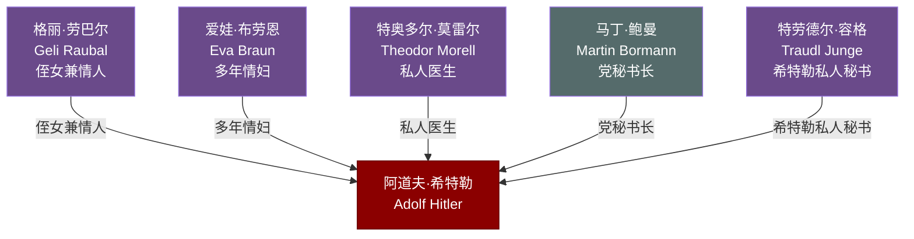

# 关系图：09-私人圈与晚期

本图展示托兰《Adolf Hitler》中"私人圈与晚期"人物与希特勒的关系网络。

## 人物说明

| 人物 | 与希特勒关系 | 档案链接 |
|------|------------|---------||
| [格丽·劳巴尔](../09-%E7%A7%81%E4%BA%BA%E5%9C%88%E4%B8%8E%E6%99%9A%E6%9C%9F/%E6%A0%BC%E4%B8%BD%C2%B7%E5%8A%B3%E5%B7%B4%E5%B0%94.md) | 侄女兼情人，1931年神秘死亡，对希特勒情感造成深刻创伤 | ✅ |
| [爱娃·布劳恩](../09-%E7%A7%81%E4%BA%BA%E5%9C%88%E4%B8%8E%E6%99%9A%E6%9C%9F/%E7%88%B1%E5%A8%83%C2%B7%E5%B8%83%E5%8A%B3%E6%81%A9.md) | 多年情妇，最终于柏林地堡中与希特勒成婚后共同自杀 | ✅ |
| [特奥多尔·莫雷尔](../09-%E7%A7%81%E4%BA%BA%E5%9C%88%E4%B8%8E%E6%99%9A%E6%9C%9F/%E7%89%B9%E5%A5%A5%E5%A4%9A%E5%B0%94%C2%B7%E8%8E%AB%E9%9B%B7%E5%B0%94.md) | 私人医生，长期为希特勒注射大量药物，加剧其健康衰退 | ✅ |
| [马丁·鲍曼](../09-%E7%A7%81%E4%BA%BA%E5%9C%88%E4%B8%8E%E6%99%9A%E6%9C%9F/%E9%A9%AC%E4%B8%81%C2%B7%E9%B2%8D%E6%9B%BC.md) | 党秘书长，掌控纳粹党内部权力，晚期成为希特勒最亲信的人物 | ✅ |
| [特劳德尔·容格](../09-%E7%A7%81%E4%BA%BA%E5%9C%88%E4%B8%8E%E6%99%9A%E6%9C%9F/%E7%89%B9%E5%8A%B3%E5%BE%B7%E5%B0%94%C2%B7%E5%AE%B9%E6%A0%BC.md) | 希特勒私人秘书，在地堡中为其口述遗嘱，亲历最后时刻 | ✅ |
