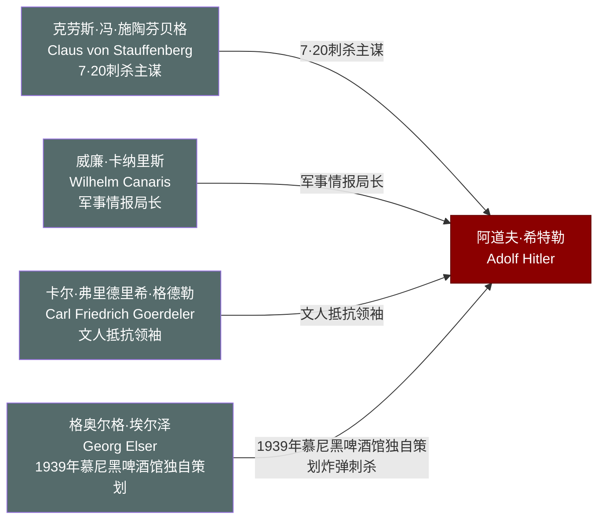

# 关系图：10-反对者与刺杀者

本图展示托兰《Adolf Hitler》中"反对者与刺杀者"人物与希特勒的关系网络。

## 人物说明

| 人物 | 与希特勒关系 | 档案链接 |
|------|------------|---------||
| [克劳斯·冯·施陶芬贝格](../10-%E5%8F%8D%E5%AF%B9%E8%80%85%E4%B8%8E%E5%88%BA%E6%9D%80%E8%80%85/%E5%85%8B%E5%8A%B3%E6%96%AF%C2%B7%E5%86%AF%C2%B7%E6%96%BD%E9%99%B6%E8%8A%AC%E8%B4%9D%E6%A0%BC.md) | 7·20刺杀主谋，在狼穴放置炸弹，事败后被枪决 | ✅ |
| [威廉·卡纳里斯](../10-%E5%8F%8D%E5%AF%B9%E8%80%85%E4%B8%8E%E5%88%BA%E6%9D%80%E8%80%85/%E5%A8%81%E5%BB%89%C2%B7%E5%8D%A1%E7%BA%B3%E9%87%8C%E6%96%AF.md) | 军事情报局长，秘密支持抵抗运动，最终被盖世太保处决 | ✅ |
| [卡尔·弗里德里希·格德勒](../10-%E5%8F%8D%E5%AF%B9%E8%80%85%E4%B8%8E%E5%88%BA%E6%9D%80%E8%80%85/%E5%8D%A1%E5%B0%94%C2%B7%E5%BC%97%E9%87%8C%E5%BE%B7%E9%87%8C%E5%B8%8C%C2%B7%E6%A0%BC%E5%BE%B7%E5%8B%92.md) | 文人抵抗领袖，曾被列为战后德国总理候选人，事败后被处决 | ✅ |
| [格奥尔格·埃尔泽](../10-%E5%8F%8D%E5%AF%B9%E8%80%85%E4%B8%8E%E5%88%BA%E6%9D%80%E8%80%85/%E6%A0%BC%E5%A5%A5%E5%B0%94%E6%A0%BC%C2%B7%E5%9F%83%E5%B0%94%E6%B3%BD.md) | 1939年慕尼黑啤酒馆独自策划炸弹刺杀，希特勒提前离场幸免 | ✅ |
