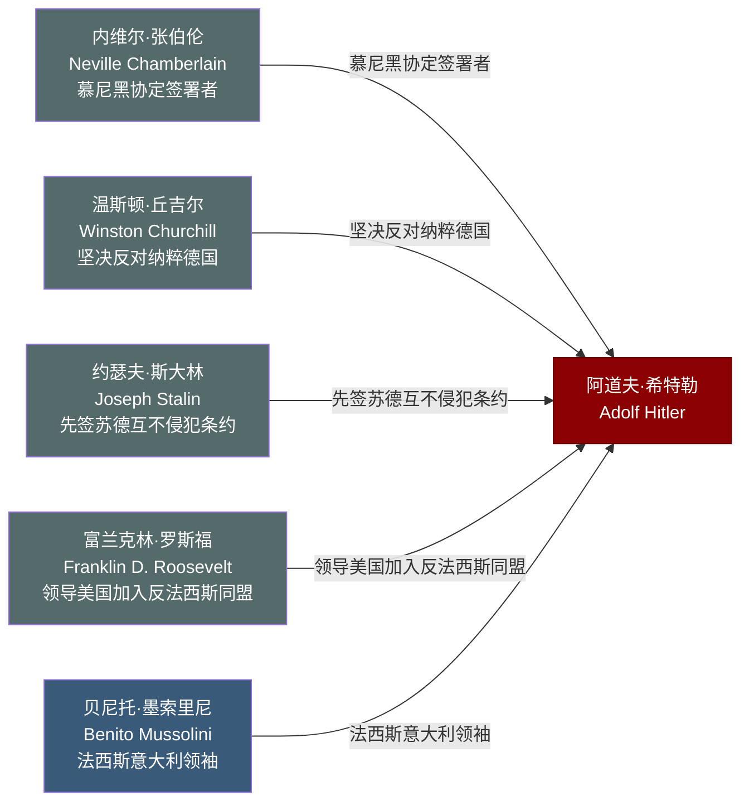

# 关系图：11-国际对手与盟友

本图展示托兰《Adolf Hitler》中"国际对手与盟友"时期人物与希特勒的关系网络。

## 人物说明

| 人物 | 与希特勒关系 | 档案链接 |
|------|------------|---------||
| [内维尔·张伯伦](../11-%E5%9B%BD%E9%99%85%E5%AF%B9%E6%89%8B%E4%B8%8E%E7%9B%9F%E5%8F%8B/%E5%86%85%E7%BB%B4%E5%B0%94%C2%B7%E5%BC%A0%E4%BC%AF%E4%BC%A6.md) | 慕尼黑协定签署者，以绥靖政策换取和平，后被希特勒背信弃义 | ✅ |
| [温斯顿·丘吉尔](../11-%E5%9B%BD%E9%99%85%E5%AF%B9%E6%89%8B%E4%B8%8E%E7%9B%9F%E5%8F%8B/%E6%B8%A9%E6%96%AF%E9%A1%BF%C2%B7%E4%B8%98%E5%90%89%E5%B0%94.md) | 坚决反对纳粹德国，领导英国抵抗希特勒侵略至最终胜利 | ✅ |
| [约瑟夫·斯大林](../11-%E5%9B%BD%E9%99%85%E5%AF%B9%E6%89%8B%E4%B8%8E%E7%9B%9F%E5%8F%8B/%E7%BA%A6%E7%91%9F%E5%A4%AB%C2%B7%E6%96%AF%E5%A4%A7%E6%9E%97.md) | 先签苏德互不侵犯条约，后遭希特勒背刺，成为致命对手 | ✅ |
| [富兰克林·罗斯福](../11-%E5%9B%BD%E9%99%85%E5%AF%B9%E6%89%8B%E4%B8%8E%E7%9B%9F%E5%8F%8B/%E5%AF%8C%E5%85%B0%E5%85%8B%E6%9E%97%C2%B7%E7%BD%97%E6%96%AF%E7%A6%8F.md) | 领导美国加入反法西斯同盟，从外交孤立走向对德宣战 | ✅ |
| [贝尼托·墨索里尼](../11-%E5%9B%BD%E9%99%85%E5%AF%B9%E6%89%8B%E4%B8%8E%E7%9B%9F%E5%8F%8B/%E8%B4%9D%E5%B0%BC%E6%89%98%C2%B7%E5%A2%A8%E7%B4%A2%E9%87%8C%E5%B0%BC.md) | 法西斯意大利领袖，钢铁盟约同盟者，最终因战败遭本国处决 | ✅ |
