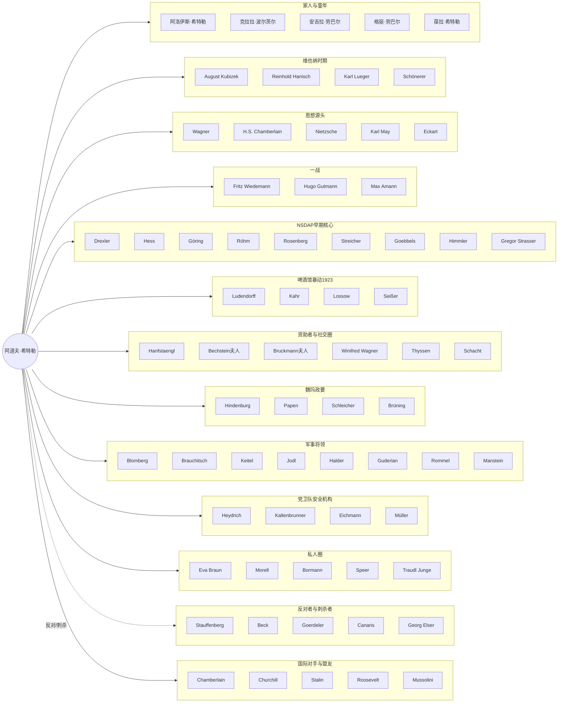

# 人物关系总览图

下图展示希特勒与其一生关键人物圈层的概括性关系。详细分时期关系图将在阶段 2 各批次完成后陆续补充到 `关系图/` 目录。

源码另存于 [`00-总览.mmd`](./00-总览.mmd)。

## 分时期关系图（阶段 2 补充）

- `01-家人童年.md`（待生成）
- `02-维也纳.md`（待生成）
- `03-一战.md`（待生成）
- `04-NSDAP早期.md`（待生成）
- `05-啤酒馆暴动.md`（待生成）
- `06-党壮大.md`（待生成）
- `07-夺权.md`（待生成）
- `08-战时.md`（待生成）
- `09-私人圈.md`（待生成）
- `10-反抗.md`（待生成）
- `11-国际.md`（待生成）
